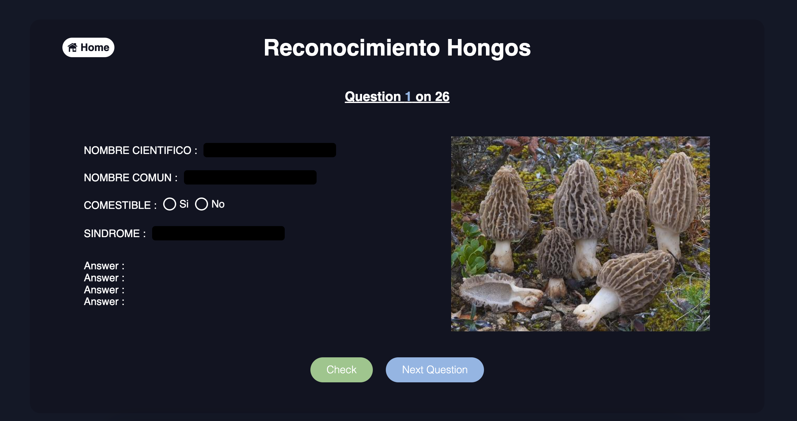

# APP Quiz Mushrooms

[](LICENSE)

Here is my application to practice learning the scientific names of mushrooms for a veterinary exam.   

## Description  

Different quizzes have been created to train at different levels in learning the scientific names of mushrooms in spanish. The user must write the corresponding values ​​in cells. A score is given to him at the end of the quiz to evaluate his performance.  



## Table of Contents

- [Getting Started](#Getting-Started)
- [Launch Application](#Launch-Application)
- [Contributing](#Contributing)
- [License](#License)  

## Getting Started    

```bash
git clone https://github.com/HaDock404/app-quiz-mushrooms.git
cd app-quiz-mushrooms
npm install
```  

## Launch Application    

```bash
npm start
```  

## Contributing

Pull requests are welcome. For major changes, please open an issue first
to discuss what you would like to change.

Please make sure to update tests as appropriate.

## License  

This project is licensed under the MIT License - see the [LICENSE](./LICENSE) file for details.